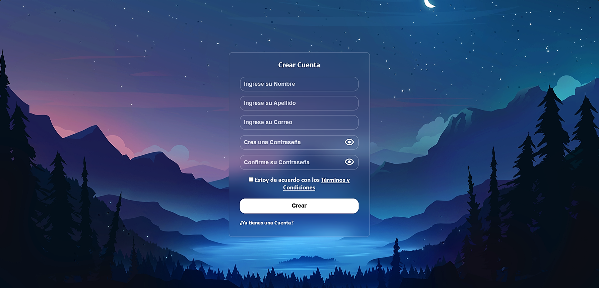

# Formulario Web Con Diseño Llamativo | HTML + CSS | Tutorial Paso a Paso

Mira el tutorial aquí: [https://PROXIMAMENTE](https://PROXIMAMENTE)

---

## Vista Previa

¡Así es como quedó el formulario web! 

**Por: [DevBy Lualmara](https://github.com/Lualmara-5)**

---

## Descripción

Este proyecto consiste en un formulario web con un diseño llamativo, implementado con **HTML** , **CSS** y **JavaScript**. El objetivo de este proyecto es mostrar cómo crear un formulario atractivo y funcional, ideal para cualquier sitio web que requiera un formulario de registro o inicio de sesión.

El tutorial paso a paso para crear este formulario estará disponible en el canal de YouTube **[DevBy Lualmara](https://www.youtube.com/@DevByLualmara)**.

---

## ¡Dame tu Apoyo!

Si te ha gustado este formulario, no dudes en darme una ⭐ al repositorio. ¡Eso me ayuda mucho a seguir creando contenido y mejorando mis proyectos!

---
